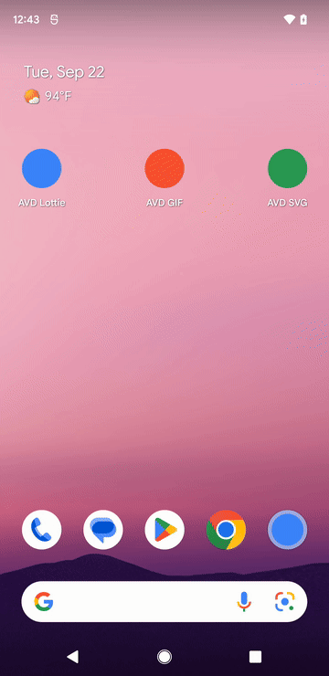

# android_avd_splash

Turns a Lottie animation, an animated SVG or an animated GIF into an Android
12+ splash screen: an `AnimatedVectorDrawable`, every resource the platform
needs around it, and the two edits that connect them to your launcher
activity. One configuration file, one command.

Recorded from release builds at the device's own 1440x2960 and 60 fps. Each
one starts on the home screen, shows the tap and the launch transition, plays
the drawable for the source's full length, and ends after the app takes over.
Select a preview to open the full-resolution video. The time in brackets is
the animation's own, not the recording's:

### Lottie — 3.97s

[](doc/demo_lottie.mp4)

### Animated SVG — 4.57s

[](doc/demo_svg.mp4)

### Animated GIF — 2.03s

[](doc/demo_gif.mp4)

```sh
dart pub add dev:android_avd_splash
dart run android_avd_splash:create
```

```yaml
# android_avd_splash.yaml
android_avd_splash:
  source: assets/splash.json
  background: "#FF102030"
  duration_ms: 1000
```

```
assets/splash.json -> @drawable/splash (Lottie, 1000 ms)
  2 paths, 63.8 KiB, 26 morphing Bezier segments per frame
  accuracy 100.0% of a 1.0000 ceiling, outline within 0.00dp
  icon reaches 95.9dp of the 96dp the platform shows
  33 files written

Launcher activity theme: @style/Theme.Splash (set in AndroidManifest.xml)
Handover: AvdSplash.install(this) in MainActivity.kt, beside AvdSplash.kt
```

No runtime dependency is added to your app: the output is platform XML plus one
generated Kotlin (or Java) file. Nothing is left at runtime to go wrong on a
device you have not tested.

## Why a drawable and not a GIF or a Lottie view

The platform splash screen draws `windowSplashScreenAnimatedIcon`, and it only
accepts an `AnimatedVectorDrawable`. Anything else - a Lottie view, an image, a
splash `Activity` - can only run *after* the window is already up, which is the
flash the splash screen API exists to remove.

## Accuracy

Lottie is vector in, vector out, so the conversion is structural and exact:
paths stay the author's Beziers, groups stay `<group>` transforms with the
author's anchor as the pivot, keyframe easing becomes `<pathInterpolator>`, and
opacity becomes `fillAlpha`. What has no Android equivalent is converted rather
than declared:

- A plate the artwork sits on becomes the splash background. The platform
  masks the icon to a circle, so a square behind the artwork can only ever be
  drawn with its corners cut - and it would spend the whole icon on colour, at
  the artwork's expense.
- A primitive that animates - a rectangle's size, an ellipse's centre, a
  corner radius - animates. So does the trim on a stroke, cut along the path by
  arc length, and a motion path, walked four times per source frame and thinned
  back to a quarter of a dp.
- An alpha track matte becomes a `<clip-path>` with the matte wound out of a
  box around the layer. A matte is composed the way it is drawn - a whole
  precomposition, with layers appearing and vanishing and carrying mattes of
  their own, and a stroke's own half-width counted as coverage - and the result
  is wound, because a clip has no fill rule to declare one with.
- A mask that keeps a layer *out* of a shape becomes the same thing: a box with
  the shape wound out of it.
- Added masks form one clip union and subtracted masks form a second union
  punched out of it. Nesting those clips reproduces their intersection with
  the layer without flattening or tracing the vector geometry.
- SMIL is read the same way. `<animateTransform>` becomes the `<group>` it
  drives, `keySplines` becomes a `<pathInterpolator>`, `keyTimes` becomes the
  keyframe fractions, an `<animate>` on `d` becomes a path morph, and a
  `<clipPath>` becomes a wound `<clip-path>`. A run that repeats for ever is
  laid out once, because a splash screen plays once.
- A curved motion path is walked. `to` and `ti` bend the path a position
  travels along, and Lottie reads it by arc length, so the curve is sampled per
  source frame and thinned back to what a person could see - Android only moves
  in a straight line between keys.
- A trim on a *filled* shape is cut into the geometry with de Casteljau,
  because Android trims only strokes.
- Group opacity is folded into the paints below it, because a `<group>` cannot
  carry any.

A GIF has to be traced, and strict pixel agreement with one has a ceiling below
1.0 - a GIF edge owns whole pixels, a vector edge cuts through them. So the run
measures that ceiling (the GIF's own contours rasterised straight back) and
reports the share of it reached. Chase the percentage, not the raw number.

| Source | Accuracy | Paths | Size | Morph load |
| --- | --- | --- | --- | --- |
| Lottie, nested precomps and track mattes | 100.0% of 1.0000 | 40 | 541 KiB | 0 |
| Lottie, stroked arcs and trims | 100.0% of 1.0000 | 13 | 83 KiB | 8 |
| Lottie, gradients and trim | 100.0% of 1.0000 | 8 | 162 KiB | 34 |
| Lottie, track mattes | 100.0% of 1.0000 | 2 | 72 KiB | 26 |
| SVG, SMIL transforms | 100.0% of 1.0000 | 10 | 80 KiB | 0 |
| GIF, flat colour | 99.5% of 0.9987 | 7 | 778 KiB | 264 |
| GIF, photographic | 97.7% of 0.9902 | 22 | 5.2 MiB | 400 |

The numbers above are this package checking itself, which is worth exactly as
much as the checker knowing what the platform does. So each release is also
measured two ways it cannot fool: against the renderer the format came from -
lottie-web for Lottie, a browser for SMIL, the decoded frames for a GIF - and
against a real device, which plays the drawable beside a strip encoding its own
elapsed milliseconds so a recorded frame can be lined up with the millisecond
the model says it is. A keyframe that arrives at the wrong time is then a
number rather than an impression.

Every run replays the XML it wrote - parsing it back, evaluating the animators
and the interpolators, rasterising the result - and reports the overlap, the
outline deviation in dp, and how far the artwork reaches. The measurement is
taken from the written files, not from the model that produced them.

## What the platform does to an animation you did not ask for

`AnimatorInflater` and `KeyframeSet` are quiet about all of this. A drawable
that breaks any of these rules still inflates, still runs, and still verifies
against anything that reads the file the way it was written rather than the way
Android reads it.

- An `<objectAnimator>` with no `android:interpolator` is
  accelerate-decelerate, and that curve is applied to the whole track before a
  keyframe is consulted. Every animator written here names the linear
  interpolator, so the only easing in the file is the author's own.
- Two keyframes at one fraction are not a step. `KeyframeSet` divides by the
  gap between the keyframes around a fraction. A step - a layer appearing, a
  GIF frame changing - is written as a change one millisecond wide instead,
  which is under a rendered frame at any length a splash screen has.
- `pathData` keyframes inside a `<propertyValuesHolder>` are ignored, and
  `android:valueFrom` cannot be left off a `pathData` animator. A morph is a
  `<set android:ordering="sequentially">` of one two-value `<objectAnimator>`
  per step.
- A track that stops short keeps drifting: the native animator extrapolates
  past its outermost keyframes instead of holding them. Every track carries a
  keyframe at 0 and at 1 - and where the timeline cuts an interval short, the
  cubic easing of that interval is split at the cut rather than reused whole.
- A `<clip-path>` has no fill type. `VectorDrawableClipPath` reads `name` and
  `pathData` and nothing else, so a clip always fills by winding and a hole in
  one has to be wound against the loop around it.
- `SplashScreenView.getIconAnimationDuration()` is capped by the platform, so
  the handover holds the screen for the drawable's own length instead.
- A compiled resource string is fifteen bits long. A longer `<path>` comes back
  broken at runtime and the splash screen answers by silently showing the
  launcher icon.
- A trim whose start has run past its end is a window across the seam, and the
  platform draws the rest of the outline. Lottie draws the arc between the
  lower and the higher of the two, so the pair is written in order, with the
  offset folded in where the two cross.
- `z` closes a contour whatever its geometry says, so an open one is drawn with
  a chord across it and a miter join at the seam. Only a contour that returns
  to its start is closed here.

## Guidelines it enforces

- The icon is drawn on a 288dp canvas and the artwork is kept inside the 192dp
  circle the platform shows; the outer third is masked. Geometry that would be
  clipped is scaled to fit, and measured after fitting rather than before.
- The theme is written whole in `values/`, `values-v31/` and `values-v33/`,
  because Android resolves a style from one configuration and styles never
  merge. Night is a colour resource, so it needs no version qualifier of its
  own - and a missing `values-night-v31` is exactly how an API 31 device in dark
  mode loses its animated icon.
- No `<path>` is written longer than an Android resource string can hold.
  `aapt2` stores a compiled XML's strings with a fifteen-bit length, so a
  longer one comes back broken, the drawable fails to inflate, and the splash
  screen answers by silently showing the launcher icon. Paths that would
  overrun it are split across `<path>` elements, keeping each outline with the
  outlines nested inside it, so the drawing is unchanged.
- An animation longer than 1000ms is reported, because the guidelines ask for
  one second or less on phones. `duration_ms:` replays it faster; every keyframe
  moves by one factor, so the motion is unchanged.
- On API 31 and 32 the platform shows the animated icon only when the app is
  launched from the launcher; every other entry point gets the background
  alone. `icon_preferred` asks for the icon everywhere, and Android 13 is
  where that attribute starts working - which is why it is written into
  `values-v33/`.
- No splash `Activity` is generated. Android 12 and up hand the screen over
  through `setOnExitAnimationListener`, held for the drawable's own length
  because the platform caps the duration it reports. Below API 31, where there
  is no platform splash screen, the generated helper plays the same drawable
  over the launch theme's background, so one animation covers every version.

## Configuration

`android_avd_splash.yaml` in the project root. Only `source:` is required.

| Option | Default | What it does |
| --- | --- | --- |
| `source` | - | `.json` Lottie, `.svg` or `.gif`, relative to the project root |
| `name` | `splash` | resource stem: `@drawable/splash`, `@style/Theme.Splash` |
| `background` | GIF's own, else white | one opaque colour, `#RRGGBB` or `#AARRGGBB` |
| `background_night` | - | the same under `values-night` |
| `icon_background` | - | optional circle behind the icon |
| `duration_ms` | the animation's own | replays it over this long |
| `canvas_dp` | `288` | drawable canvas; the outer third is masked |
| `safe_radius_dp` | `96` | how far the artwork may reach from the centre |
| `max_morph` | `400` | morphing Bezier segments allowed per frame; `0` lifts it |
| `icon_preferred` | `true` | ask Android 13+ to show the icon regardless of entry point |
| `android_dir` | `android` | the Android module inside the project |
| `patch_manifest` | `true` | set `android:theme` on the launcher activity |
| `patch_activity` | `true` | write the handover call into the activity |
| `verify` | `true` | replay the written XML and report |
| `gradients` | `true` | fill a region with a gradient when it needs one |
| `trim` | `true` | drop time at either end where nothing is drawn, and a GIF's static tail |
| `smooth` | measured | GIF only: blur in source pixels before tracing |
| `colors` | the GIF's own | GIF only: paint colours, front to back |

`create` also takes `--project <dir>`, `--config <path>` and `--dry-run`.

## What it writes

Into `android/app/src/main/`:

```
res/drawable/splash.xml              the <animated-vector>
res/drawable/splash_vector.xml       its <vector>: groups, clip paths, paths
res/animator/splash_*.xml            one animator per animated property
res/interpolator/splash_ease*.xml    one <pathInterpolator> per distinct easing
res/values/splash.xml                background colour, icon size, duration
res/values-night/splash.xml          the night background
res/values/splash_styles.xml         launch theme below API 31
res/values-v31/splash_styles.xml     the platform splash screen theme
res/values-v33/splash_styles.xml     the same, asking for the icon explicitly
kotlin/.../AvdSplash.kt              the handover, generated and commented
```

and edits two files: `android:theme` on the launcher activity in
`AndroidManifest.xml`, and one marked block in `MainActivity`. Both edits are
textual and idempotent - the manifest is not reserialised, and the activity
block is delimited by comment markers, so a second run replaces exactly what
the first one wrote and nothing you added. Resources from an earlier run that
this one no longer needs are deleted rather than left to ship in the APK.

## Converting without a project

```sh
dart run android_avd_splash:avdgen logo.json --out path/to/res
dart run android_avd_splash:avdgen logo.svg --out path/to/res
dart run android_avd_splash:avdgen logo.gif --dry-run
```

`avdgen` writes the drawable, its animators and its interpolators, and nothing
else: no theme, no colours, no edits.

## As a library

```dart
import 'package:android_avd_splash/android_avd_splash.dart';

final result = createSplash(SplashConfig.read('.'));
print(result.report?.ofCeiling);

final drawable = convertSvg(File('logo.svg').readAsBytesSync());
print(drawable.files['drawable/splash.xml']);
```

## Limits

- An SVG is read for its own animation: SMIL. CSS `@keyframes`, `<style>`
  rules and class selectors, `<mask>`, `<filter>`, `<pattern>`, `<text>` and
  `<image>` are reported, not silently dropped - and so is a skew, because a
  `<group>` has no shear and no pair of scales and rotations makes one.
- A colour that animates is reported. `AnimatedVectorDrawable` can animate
  one, but a path here carries a single paint, so a file that recolours itself
  would otherwise show the first colour as if it never changed.
- Lottie repeaters, merge paths, star shapes, luma mattes, text, image and
  solid layers are reported, not silently dropped.
- A mask on a layer that is itself being used as a matte is reported. Its
  coverage requires intersecting two independently animated regions while
  flattening the whole result into the single clip path Android accepts.
- `AnimatedVectorDrawable` cannot animate a gradient, so a gradient is fitted
  once, from the frame that shows its region most fully.
- A `<clip-path>` is not anti-aliased and has no fill type, so a matte edge is
  harder than Lottie draws it, and a self-intersecting matte outline - one the
  even-odd rule would hollow out - cannot be expressed. Nested outlines, which
  is what mattes are in practice, can.
- A GIF that crops its own artwork produces cropped outlines, faithfully. On a
  small source one GIF pixel covers several dp once blown up to icon size, so
  trace from the largest source you have - or convert the vector artwork
  instead.
- iOS is out of scope. This generates Android platform resources.
